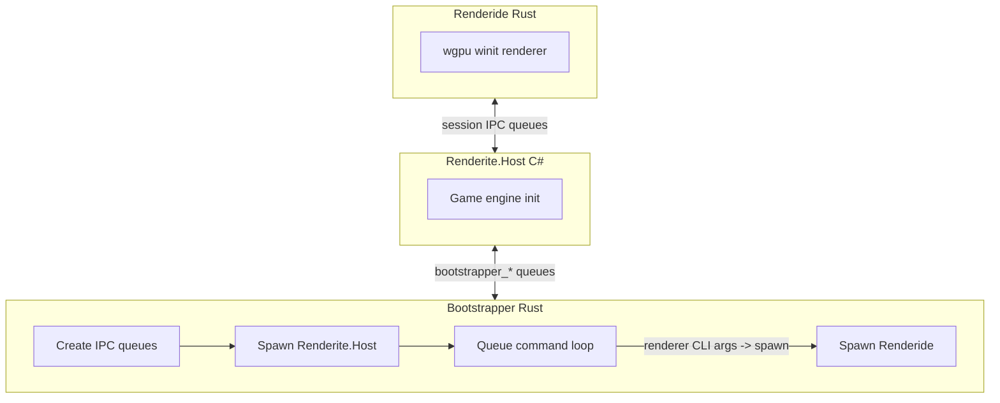

# Renderide

A Rust renderer for Resonite, replacing the Unity renderer with a custom Unity-like one using [wgpu](https://github.com/gfx-rs/wgpu).

## Warning

This renderer is experimental: performance, platform support, and stability are limited. It is not for general consumer use currently. Many rendering-related options are enabled or exposed for testing; visual bugs or unexpected behavior are possible.

## Prerequisites

### Rust

Install the current stable toolchain with [rustup](https://rustup.rs/). On Linux and macOS you can use:

`curl --proto '=https' --tlsv1.2 -sSf https://sh.rustup.rs | sh`

On Windows, download and run [rustup-init.exe](https://rustup.rs/) from the same site, or use `winget install Rustlang.Rustup` if you use winget.

This workspace uses Rust edition 2024. If `cargo build` fails with an edition error, run `rustup update stable` and try again.

### Resonite and Renderite

To run the full stack you need a Resonite installation that includes Renderite (so `Renderite.Host.dll` is present). The bootstrapper runs the host with the system `dotnet` executable; install a compatible .NET runtime if prompted.

Resonite is located via `RESONITE_DIR`, `STEAM_PATH`, common Steam install paths, or Steam’s `libraryfolders.vdf`. On Windows the bootstrapper can also consult the Steam registry. Set `RESONITE_DIR` to your game folder if discovery fails.

### Optional (contributors)

- [.NET 10 SDK](https://dotnet.microsoft.com/download) for SharedTypeGenerator and UnityShaderConverter under `generators/`.
- [Slang](https://shader-slang.com/) only if you run UnityShaderConverter with `slangc` (put `slangc` on `PATH`, set `SLANGC`, or pass `--slangc`). Use `--skip-slang` to skip that when committed WGSL is enough.

## Build and run

Run these from the `Renderide/` directory (the Cargo workspace root).

```bash
cargo build --release
cargo run --release -p bootstrapper
```

The bootstrapper expects the `renderide` binary next to itself (for example under `target/release/`). On Linux it may run the process as `Renderite.Renderer` and create a symlink to `renderide` if needed; on Windows it uses `renderide.exe`.

On Linux, if Wine is in use, the bootstrapper uses `LinuxBootstrap.sh` from the Resonite directory. On Windows, Wine does not apply.

Optional [`configuration.ini`](configuration.ini) may sit next to the renderer executable or in the current working directory. Keys and layout are defined in [`crates/renderide/src/config.rs`](crates/renderide/src/config.rs).

## Overview

Resonite (formerly Neos VR) is a VR and social platform. Renderite is its renderer abstraction (Host, Shared, Unity). Renderide is a cross-platform drop-in renderer that works with the native .NET host on Windows, Linux, and other supported setups.



## Repository layout

IPC summary: `{prefix}.bootstrapper_in` / `{prefix}.bootstrapper_out` connect the host and bootstrapper. The host and Renderide use separate shared-memory queues named in the renderer argv (for example via `-QueueName` in the first message). The bootstrapper’s queue loop keeps running after it spawns the renderer. On the wire, only `HEARTBEAT`, `SHUTDOWN`, `GETTEXT`, and lines starting with `SETTEXT` are special-cased; any other line is split into whitespace-separated argv tokens and passed to spawn `renderide` (the Rust code names this `StartRenderer`). The host is expected to send renderer CLI arguments as its first message, then periodic heartbeats and `SHUTDOWN` on exit.

### Rust crates

| Crate | Path | Role |
|-------|------|------|
| interprocess | [`crates/interprocess/`](crates/interprocess/) | Shared-memory IPC queues (Publisher/Subscriber, circular buffers) used by bootstrapper and renderide |
| logger | [`crates/logger/`](crates/logger/) | Logging shared by bootstrapper and renderer |
| bootstrapper | [`crates/bootstrapper/`](crates/bootstrapper/) | Creates `bootstrapper_in` / `bootstrapper_out` queues, spawns Renderite.Host from the Resonite install, runs the queue loop, starts Renderide when the host sends spawn tokens; Wine on Linux |
| renderide | [`crates/renderide/`](crates/renderide/) | Main renderer: `renderide` and `roundtrip` binaries, scene, assets, WGSL under [`src/shaders/`](crates/renderide/src/shaders/); UnityShaderConverter writes under `src/shaders/generated/<stem>/` and merges [`shaders/mod.rs`](crates/renderide/src/shaders/mod.rs) above `// --- END UNITY_SHADER_CONVERTER_GENERATED ---` |

### Third-party trees

[`third_party/`](third_party/) holds UnityShaderParser and Resonite.UnityShaders as vendored trees (files live in this repository). Some forks or workflows may still attach these as git submodules; if those directories are empty after clone, run `git submodule update --init --recursive` from the `Renderide/` directory.

| Path | Role |
|------|------|
| [`third_party/UnityShaderParser/`](third_party/UnityShaderParser/) | Unity ShaderLab / HLSL parsing for UnityShaderConverter |
| [`third_party/Resonite.UnityShaders/`](third_party/Resonite.UnityShaders/) | Upstream Resonite shaders (default converter input roots include this and sample shaders) |

## Development

### SharedTypeGenerator

`generators/SharedTypeGenerator/` (C# / .NET 10) turns `Renderite.Shared.dll` into Rust types and pack logic in `crates/renderide/src/shared/shared.rs` (generated; edit the generator, not that file by hand). Pipeline: TypeAnalyzer (Mono.Cecil) -> PackMethodParser (IL -> serialization steps) -> RustTypeMapper -> RustEmitter / PackEmitter, producing `MemoryPackable` implementations that match the C# wire format.

```bash
cd Renderide
dotnet run --project generators/SharedTypeGenerator -- -i /path/to/Renderite.Shared.dll
```

Default output path is `crates/renderide/src/shared/shared.rs`. Use `-o` to write elsewhere.

### UnityShaderConverter

`generators/UnityShaderConverter/` (C# / .NET 10) emits Rust modules and WGSL under `crates/renderide/src/shaders/generated/`. Uses UnityShaderParser. Unrelated to SharedTypeGenerator (Cecil/IL -> `shared.rs`).

Typical commands (from `Renderide/`):

```bash
# Fast: no slangc; keeps existing WGSL on disk where present
dotnet run --project generators/UnityShaderConverter -- --skip-slang

# Full run including slangc (Slang on PATH, or SLANGC / --slangc)
dotnet run --project generators/UnityShaderConverter --
```

Add `-v` / `--verbose` for more log output. `dotnet run --project generators/UnityShaderConverter -- --help` lists flags such as `--input`, `--output`, `--compiler-config`, and `--variant-config`.

### Testing

`generators/SharedTypeGenerator.Tests/` (xUnit): C# packs a random instance -> bytes A; Rust `roundtrip` unpacks and repacks -> bytes B; assert `A == B`.

Prerequisite: `Renderite.Shared.dll` in `generators/SharedTypeGenerator.Tests/lib/` or set `RENDERITE_SHARED_DLL`.

```bash
cd Renderide
cargo build --bin roundtrip
dotnet test generators/SharedTypeGenerator.Tests/
dotnet test generators/UnityShaderConverter.Tests/
cargo test -p renderide minimal_unlit_sample_wgsl_parses
```

### Debugging

`Bootstrapper.log`, `HostOutput.log`, and `Renderide.log` under `logs/` are relative to the bootstrapper’s current working directory. At startup the bootstrapper truncates `HostOutput.log` and `logs/Renderide.log` there for a clean run. The renderer also appends to `Renderide.log` at a path derived from the renderide crate at build time (`CARGO_MANIFEST_DIR`). If the bootstrapper CWD matches the repo layout used at build time, those paths are the same file; otherwise you can get two different `Renderide.log` files; run from a consistent directory when correlating logs.

Verbosity: bootstrapper defaults to `trace`; renderer to `info` unless `-LogLevel` is passed. Pass `--log-level <level>` or `-l <level>` on the bootstrapper (`error`, `warn`, `info`, `debug`, `trace`) to cap both and forward `-LogLevel` to Renderide.

```bash
cargo run --release -p bootstrapper -- --log-level debug
```

| Log | Path | Created by |
|-----|------|------------|
| Bootstrapper.log | `logs/Bootstrapper.log` | Bootstrapper - orchestration, queue commands, errors |
| HostOutput.log | `logs/HostOutput.log` | Bootstrapper - C# host stdout/stderr with `[Host stdout]` / `[Host stderr]` prefixes |
| Renderide.log | `logs/Renderide.log` | Renderide - renderer diagnostics (see dual-path note above) |

GPU validation (wgpu): Off by default for performance. Set `RENDERIDE_GPU_VALIDATION=1` (or `true` / `yes`) before the first GPU init so `RenderConfig::gpu_validation_layers` is applied when the wgpu instance is created; it cannot be toggled later without restarting the process. On Linux and macOS export the variable in the shell before starting; on Windows use `set RENDERIDE_GPU_VALIDATION=1` in Command Prompt or `$env:RENDERIDE_GPU_VALIDATION=1` in PowerShell for the session.

After that, wgpu’s `WGPU_VALIDATION` is still applied via [`InstanceFlags::with_env`](https://docs.rs/wgpu/latest/wgpu/struct.InstanceFlags.html#method.with_env): any value other than `0` forces validation on; `0` forces it off. Expect a large performance cost; use only while debugging API issues.

## Goals

- Cross-platform renderer with correct materials, meshes, skinned meshes, shaders, and textures; strong performance and correctness as features land
- Type-safe IPC between host and renderer via generated shared types
- Optional advanced lighting and effects (for example, RT-style techniques) as a superset of Unity; nothing is added that would require data model changes

## License

See [LICENSE](LICENSE).
